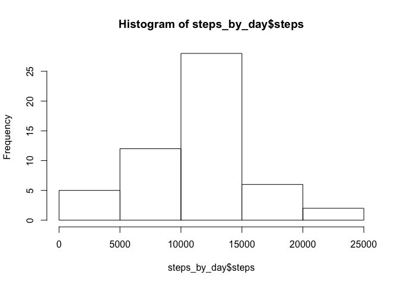
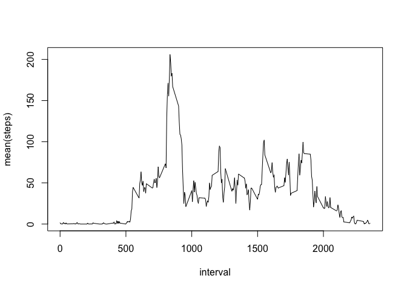
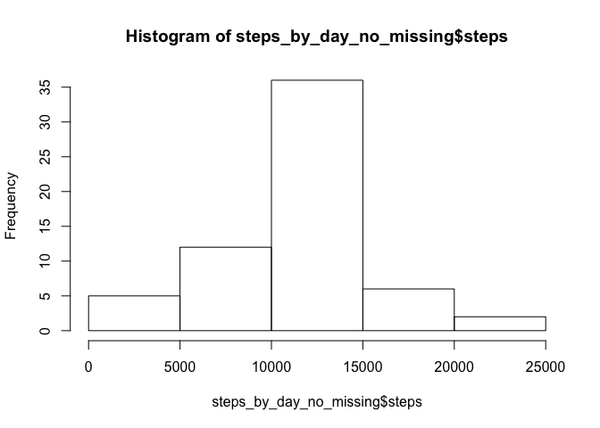

# Reproducible Research: Peer Assessment 1


## Loading and preprocessing the data

```r
library(dplyr)
library(lattice)
unzip(zipfile = "activity.zip",overwrite = T)
activity <- read.csv(file = "activity.csv",header = TRUE)
activity[,2]<-as.Date(activity[,2])
```

## What is mean total number of steps taken per day?
#### Calculate the total number of steps taken per day

```r
activity=tbl_df(activity)
act_by_day=group_by(activity,date)
steps_by_day=summarise(act_by_day, sum(steps))
names(steps_by_day)[2]="steps"
```
#### Histogram of the total number of steps taken each day

```r
hist(steps_by_day$steps)
```

 
  
#### Mean of the total number of steps taken per day

```r
mean(steps_by_day$steps,na.rm = T)
```

```
## [1] 10766.19
```
#### Media of the total number of steps taken per day

```r
median(steps_by_day$steps,na.rm = T)
```

```
## [1] 10765
```

## What is the average daily activity pattern?

```r
steps_by_interval=activity[!is.na(activity$steps),] %>%group_by(interval) %>% summarize(mean(steps))
```
#### Time series plot of the 5-minute interval (x-axis) and the average number of steps taken, averaged across all days (y-axis)

```r
plot(steps_by_interval,type="l")
```

 
  
#### Which 5-minute interval, on average across all the days in the dataset, contains the maximum number of steps?

```r
max_interval<-steps_by_interval[which.max(as.matrix(steps_by_interval["mean(steps)"])),1]
```
The 5-minute interval with maximum number of days is __835__

## Imputing missing values
  
#### Number of missing values on data set:

```r
sum(is.na(activity[,1]))
```

```
## [1] 2304
```
#### Filling missing values

```r
activity_no_missing<-inner_join(activity,steps_by_interval,by="interval")
activity_no_missing[is.na(activity_no_missing$steps),2]<-activity_no_missing[is.na(activity_no_missing$steps),4]
```
#### Creating a new dataset with missing values filled with average by interval

```r
activity_no_missing<-select(activity_no_missing, steps,date,interval)
act_by_day_no_missing=group_by(activity_no_missing,date)
steps_by_day_no_missing=summarise(act_by_day_no_missing, sum(steps))
names(steps_by_day_no_missing)[2]="steps"
```
#### Histogram of steps by day with missing values filled

```r
hist(steps_by_day_no_missing$steps)
```

 
  
#### Mean and Median with missing values filled

```r
mean(steps_by_day_no_missing$steps)
```

```
## [1] 10766.19
```

```r
median(steps_by_day_no_missing$steps)
```

```
## [1] 10766.19
```

## Are there differences in activity patterns between weekdays and weekends?
#### Create factor variables weekend and weekday.
The new column is named period

```r
steps_by_interval=activity[!is.na(activity$steps),] %>%group_by(interval) %>% summarize(mean(steps))
activity_no_missing<-inner_join(activity,steps_by_interval,by="interval")
activity_no_missing[is.na(activity_no_missing$steps),2]<-activity_no_missing[is.na(activity_no_missing$steps),4]

activity_no_missing$period<-ifelse(weekdays(activity_no_missing$date) %in% c("Saturday","Sunday"),"weekend","weekday")

steps_by_interval.weekday=activity_no_missing[activity_no_missing$period=="weekday",] %>%group_by(interval) %>% summarize(mean(steps))
names(steps_by_interval.weekday)[2]="steps"
steps_by_interval.weekend=activity_no_missing[activity_no_missing$period=="weekend",] %>%group_by(interval) %>% summarize(mean(steps))
names(steps_by_interval.weekend)[2]="steps"

steps_by_interval.weekend$period <-rep(x = "weekend",times = length(steps_by_interval.weekend$steps))
steps_by_interval.weekday$period <-rep(x = "weekday",times = length(steps_by_interval.weekday$steps))
merged<-rbind(steps_by_interval.weekend, steps_by_interval.weekday)
```
#### Time series plots of the 5-minute interval for weekdays and weekend.

```r
xyplot(steps~interval|period,type="l",data = merged,layout=c(1,2))
```

 
